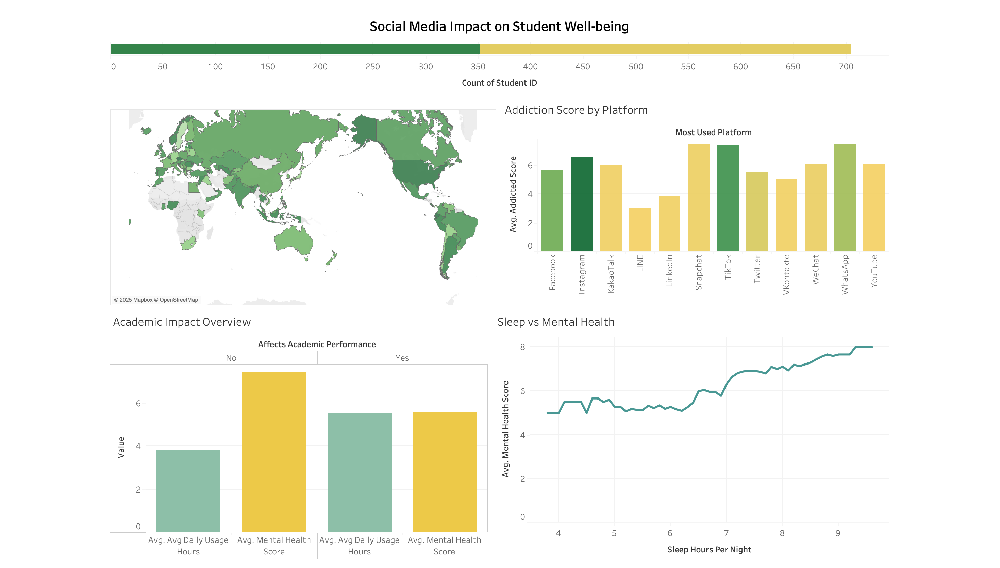

## Project Overview
This project explores the impact of social media usage on student behavior and well-being, using SQL for data analysis and Tableau for interactive visualization.
The dataset includes student demographics, daily usage patterns, platform preferences, and mental health indicators.

## Tools Used
- SQL (PostgreSQL) – for data querying and analysis
- Tableau Public – for dashboard creation and visualization

## Key Insights
- Instagram and TikTok have the highest average addiction scores.
- Students who reported academic impact from social media usage tend to have lower mental health scores.
- Longer sleep duration is positively correlated with better mental health.
- Significant usage variance across different countries and platforms.

## Dashboard Preview

[View Full Dashboard on Tableau Public](https://public.tableau.com/views/Book1_17506455295920/Dashboard1) 

## Dataset
The dataset titled **"Students Social Media Addiction"** contains records of students including their demographics, daily social media usage, most used platforms, sleep duration, mental health scores, relationship status, and addiction indicators.  
File: `SocialMedia.csv`

## SQL Analysis
All SQL queries used for analysis are included in [`analysis.sql`](analysis.sql).
